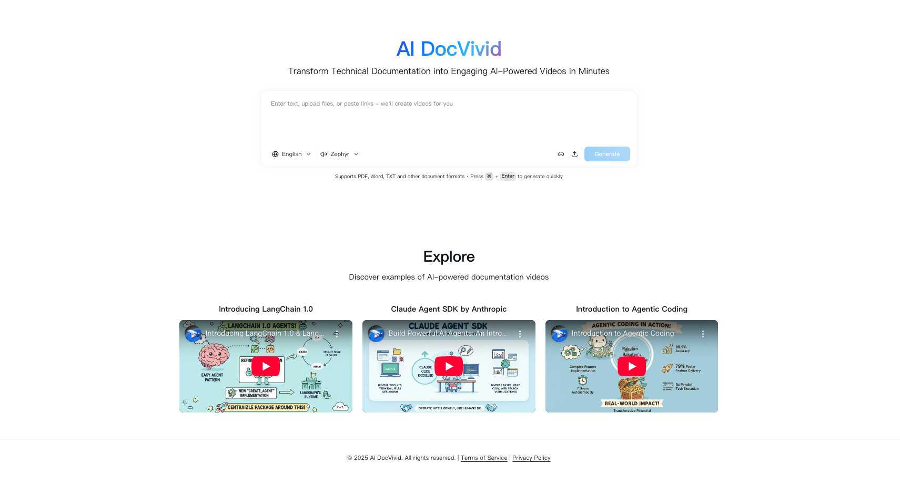

## OpenDocvivid（中文文档）

OpenDocvivid 是一款现代化的、由 AI 驱动的文档生成视频工具。  
它帮助你上传内容（文档、网页），通过大语言模型进行处理，并生成图文并茂的视频。

## 截图


### 核心特性

- **AI 视频生成**： 基于文档内容、文件、网址,大模型处理后自动生成视频。
- **任务驱动的处理流程**：支持异步任务系统，用于处理耗时操作（如视频处理、积分/用量更新等）。
- **用户与订阅体系**：提供用户认证、订阅管理以及积分/额度记账。
- **现代 Web 界面**：基于 Next.js/React 的前端，提供响应式、应用化的交互体验。
- **可扩展后端**：基于 FastAPI 的后端（配合 Celery Worker），易于扩展新的路由、任务和领域模型。

---

## 技术栈

### 后端

- **语言**：Python（详见 `backend/pyproject.toml` 与 `backend/uv.lock`）
- **Web 框架**：FastAPI（核心入口为 `backend/src/app.py` 和 `backend/main.py`）
- **任务队列**：Celery（`backend/src/celery_app.py` 与 `backend/src/tasks/*`）
- **数据模型**：
  - `backend/src/models/user_models.py` – 用户实体
  - `backend/src/models/subscription_models.py` – 订阅与套餐实体
  - `backend/src/models/task_modes.py` – 任务相关配置
- **服务层**：
  - `backend/src/services/user_service.py` – 用户管理
  - `backend/src/services/subscription_service.py` – 订阅逻辑
  - `backend/src/services/credit_service.py` – 积分/额度逻辑
  - `backend/src/services/video_service.py` – 视频相关逻辑
- **API / 路由**（FastAPI 路由模块）：
  - `backend/src/routes/auth.py` – 认证与会话相关 API
  - `backend/src/routes/credit.py` – 积分与计费相关 API
  - `backend/src/routes/video.py` – 视频任务相关 API
  - `backend/src/routes/system.py`、`backend/src/routes/webhook.py` – 系统与 Webhook 接口
- **工具与基础设施**：
  - `backend/src/clients/llm.py` – LLM 客户端集成
  - `backend/src/clients/redis.py` – Redis 客户端
  - `backend/src/utils/security.py`、`backend/src/utils/middleware.py` – 安全与中间件工具
  - `backend/src/libs/postgresql_transactional.py` – PostgreSQL 事务工具

### 前端

- **框架**：Next.js（App Router 模式）位于 `frontend/app`
- **语言**：TypeScript + React
- **样式 / UI**：
  - 全局样式：`frontend/app/globals.css`
  - 可复用 UI 组件：`frontend/components/ui/*`
  - 自定义业务组件：如 `account-dialog`、`app-sidebar`、`doc-vivid-input`、`explore-content`、`pricing-content` 等
- **客户端库**：
  - API 封装：`frontend/lib/api/*`
  - 类型定义：`frontend/lib/types/api.ts`
  - 自定义 Hooks：`frontend/hooks/*`（例如 `use-auto-resize-textarea`、`use-mobile`）
- **认证与 API 路由**：
  - NextAuth 路由：`frontend/app/api/auth/[...nextauth]/route.ts`
  - 健康检查路由：`frontend/app/api/health/route.ts`

---

## 整体架构概览

### 逻辑分层

- **前端（Next.js）**：
  - 通过 `frontend/app` 提供用户界面。
  - 使用 `frontend/lib/api/*` 中的客户端与后端 API 通信。
  - 通过 NextAuth 路由管理会话与认证。

- **后端（FastAPI + Celery）**：
  - 核心 API 由 `backend/src/app.py` 与 `backend/main.py` 暴露。
  - `backend/src/routes/*` 下的路由提供认证、积分、视频及系统功能。
  - 业务逻辑集中在 `backend/src/services/*`。
  - 数据模型与数据库访问位于 `backend/src/models/*` 和 `backend/src/libs/postgresql_transactional.py`。
  - 后台与长耗时任务通过 Celery 在 `backend/src/tasks/*` 中实现，入口为 `backend/src/celery_app.py`。

- **外部服务**：
  - 通过 `backend/src/clients/llm.py` 调用 LLM 服务提供商。
  - 通过 `backend/src/clients/redis.py` 使用 Redis 做缓存与任务协调。
  - 使用 PostgreSQL（或兼容的 SQL 数据库）作为持久化存储。

---

## 快速开始

### 前置条件

- Node.js（版本参考 `frontend/package.json`，建议使用最新 LTS）
- pnpm（推荐）或 npm / yarn
- Python（版本参考 `backend/pyproject.toml`）
- 可用的 PostgreSQL 实例
- 可用的 Redis 实例

### 后端环境搭建

在项目根目录下执行：

```bash
cd backend

# 创建并激活虚拟环境（以 venv 为例）
python -m venv .venv
source .venv/bin/activate  # Windows 上为 .venv\Scripts\activate

# 安装依赖（根据你的环境选择 uv 或 pip）
uv sync  # 使用 uv 的方式
```

通过环境变量（例如 `.env` 文件）配置：

- **数据库连接**（PostgreSQL）
- **Redis 连接**
- **LLM 提供商的 API Key**
- **认证 / 安全配置**（如 JWT 密钥等）

然后启动 API 服务（以 uvicorn 为例）：

```bash
cd backend
python main.py
```

启动 Celery Worker（示例命令）：

```bash
cd backend
celery -A src.celery_app worker --beat -l INFO -Q default,generate_task_queue
```

> 注意：Celery 的模块路径可能因 `celery_app` 的导出方式不同而略有区别，请根据实际情况调整。

### 前端环境搭建

在项目根目录下执行：

```bash
cd frontend
pnpm install
pnpm dev
```

这将启动 Next.js 开发服务器（默认端口通常为 `http://localhost:3000`）。

请确保通过环境变量（如 `NEXT_PUBLIC_API_URL`）配置前端所使用的后端 API 地址。

---

## 开发说明

- **代码风格与检查**：
  - 前端的 Lint 规则由 `frontend/eslint.config.mjs` 配置。
  - 类型检查由 `frontend/tsconfig.json` 配置。
  - 在扩展功能时，建议参考 `frontend/components` 与 `backend/src/services` 中现有的代码模式。

- **新增后端功能**的推荐步骤：
  - 在 `backend/src/schemas/*` 中定义或扩展 Pydantic Schema。
  - 在 `backend/src/services/*` 中增加对应的业务服务模块。
  - 在 `backend/src/routes/*` 中新增或扩展路由以暴露 API。

- **新增前端功能**的推荐步骤：
  - 在 `frontend/app` 中新增页面（基于 App Router）。
  - 复用 / 扩展 `frontend/components` 与 `frontend/components/ui` 中的组件。
  - 在 `frontend/lib/api/*` 中增加新的 API 客户端函数以调用后端接口。


